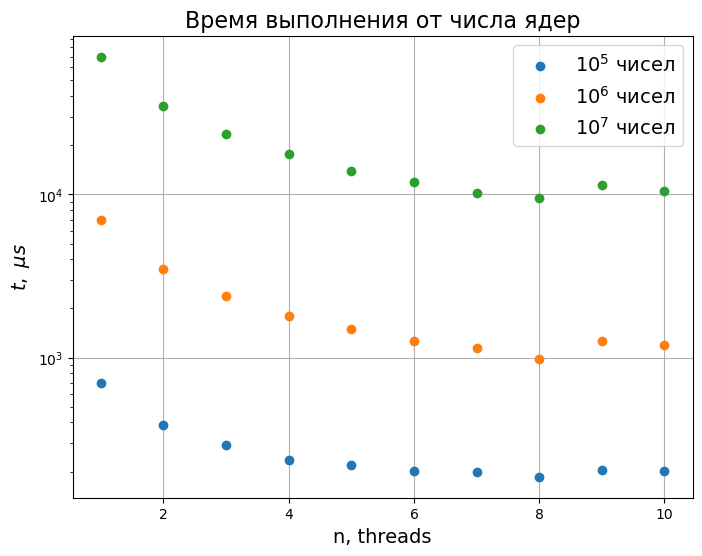

## Контрольные вопросы

1. Необходимо понять, имеет ли это целисообразность. Также надо следить за использованием общего ресурса, чтобы не было неопределенного поведения.

2.


## [Задание 1](./main1.cpp)

Протестируем скорость работы `parallel_accumulate` в зависимости от числа ядер и количества элементов в массиве. Количество ядер на моем ноутбуке - 10.



Видно, что скорость выполнения при увеличении количества чисел растет линейно. При увеличении количества ядер время вычислений быстро уменьшается. Начиная с 7 ядер различие уже не такое существенное. Минимальное время работы достигается при использовании 8 ядер из 10. Это может быть обусловлено тем, что ~2 ядра задействованы под операционную систем, фоновые программы и выполнение самой программы.


## [Задание 2](./main2.cpp)

Условие задачи было не совсем понятно, поэтому сделал, как понял:)
К каждому элементу исходного массива применяется какая-то функция `f()`. Ниже представлен пример, где проверялась простота числа.
```
Output:
9428052427 528480011 668148709 8671804759 332626237
0 1 1 0 1
```
